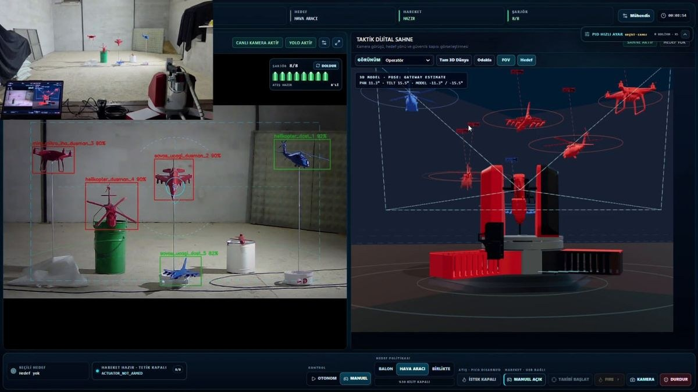

# Target Tracking & Engagement System

Vision-guided, two-axis pan/tilt turret that detects, tracks and engages balloon targets — including balloons tethered under moving aircraft models, with friend/foe discrimination. Built by a student team for an air-defense competition (2026).

**Award:** Finalist — **Best System Design Award** (TEKNOFEST 2026 ÇELİKKUBBE, low-altitude air defense category).

**Field result (final run):** Stage 2 — 11/12 balloons hit · Stage 3 (moving aircraft + IFF) — 7/8 hit.



*Operator console — left: live camera with aircraft detections labelled friend (green) / foe (red); right: real-time 3D digital twin of the turret, targets and camera FOV, driven by the same pose and detection stream.*

> This is a source snapshot of the competition-day software. Trained models, logs, datasets and recorded media are intentionally **not** included.

---

## Architecture

```
 USB camera ──► Vision pipeline (YOLO: balloon + aircraft body)
                    │  body tracker · balloon↔body association · IFF colour
                    ▼
               Target engagement registry  (who to shoot, who is already destroyed)
                    │
                    ▼
               Auto-tracker ── pixel PID + feed-forward + lead ──► Command gateway
                    │                                                  │ safety gates
                    │  fire gate (crosshair ∩ target radius)          ▼
                    └──────────────────────────────────────► Serial (460800 baud)
                                                                       │
                                                         Raspberry Pi Pico 2 (firmware/)
                                                         ├─ TMC2209 ×2 (UART + STEP/DIR) → pan / tilt steppers
                                                         ├─ limit switches, 24 V supervision
                                                         └─ trigger servo
 Operator UI (Vue 3) ◄── WebSocket (~30 Hz) ── FastAPI backend
   cockpit · joystick · digital twin · calibration wizards
```

| Folder | Contents |
|---|---|
| `backend/` | Python 3.12 · FastAPI. Vision pipeline, trackers, engagement logic, safety gates, serial protocol, tests |
| `frontend/` | Vue 3 + Vite + Tailwind operator console (cockpit, gamepad/joystick control, 3D digital twin via three.js) |
| `firmware/` | Pico 2 firmware (`sistem.ino`, Arduino-Pico, dual core) plus older MicroPython/telemetry variants |
| `light_reference/` | The lightweight original stage scripts the backend controllers were derived from |
| `tools/simulation/` | Offline replay / Monte-Carlo shot simulation used to compare tracking controllers |
| `competition_patches/` | Small patch scripts applied on competition day (Y17–Y19) — kept for reference; already merged into this tree |
| `config/` | Default config (runtime state files excluded) |
| `docs/SETUP_TR.md` | Original setup guide (Turkish) |

## Key algorithms

**Tracking controller** (`backend/app/services/light_tracking_controller_21eylul.py`)
- Pixel-error PID (Kp 11/8, Kd 1.1/2.0, Ki 0) on an EMA-smoothed target centre (α = 0.25).
- Lead aiming: up to 0.30 × bbox width ahead of the target, enabled above 8.5 px/s and released below 4.25 px/s (hysteresis).
- Velocity feed-forward (0.65), only while lead is active.
- 3 px deadband, minimum speed 120, acceleration limit 7000, max speed 8000 steps/s.
- No Kalman filter in the competition path — a lightweight EMA proved more stable for this hardware. (Kalman/ByteTrack/BoT-SORT adapters exist in `live_tracker_bridge.py` but were disabled.)

**Fire gate** — shoot when the balloon centre *or* the lead point lies within `r = max(10 px, 0.15 · bbox_w)` of the crosshair (frame centre + boresight offset), after 0.15 s of stable lock; 0.6 s cooldown synced to the ~0.58 s servo stroke.

**Track keeping on loss (Y15)** — when the detection drops, re-lock the nearest balloon within `max(120 px, 3 · bbox_w)`; otherwise brake speed ×0.6 per tick instead of stopping dead.

**Stage 3 IFF** — aircraft bodies and balloons are detected separately; each balloon is associated with the body above it (strict attachment ROI, ambiguity margin, mission-scoped ownership lock) so a friendly aircraft's balloon is never engaged.

**Feature flags** — competition safety patches are toggled via `backend/app/services/yarisma_bayraklari.py` (`Y2…Y15`, all on by default; override with `yarisma_bayraklari.ini` or `ISTIKLAL_Yn=0`).

## Running

```bash
# backend
cd backend
python -m venv .venv && . .venv/bin/activate
pip install -e .
uvicorn app.main:app --host 0.0.0.0 --port 8000

# frontend
cd frontend
pnpm install      # or npm install
pnpm dev
```

YOLO weights are not included; place your own under `models/` and point the vision profile at them. Without hardware the backend can run with the mock serial transport and mock camera (`backend/app/mocks/`).

Firmware: open `firmware/sistem.ino` with the Arduino-Pico core (Pico 2 / RP2350), TMCStepper library.

## Snapshot notes

- Assembled after the competition from the most recent copies available; the Windows field laptop was offline, so a few competition-day UI tweaks were re-applied by hand (joystick deadzone/curve v4, sniper-zoom speed scale 0.18).
- Comments and log messages are mostly Turkish.
- Code is provided as-is for reference and learning.
